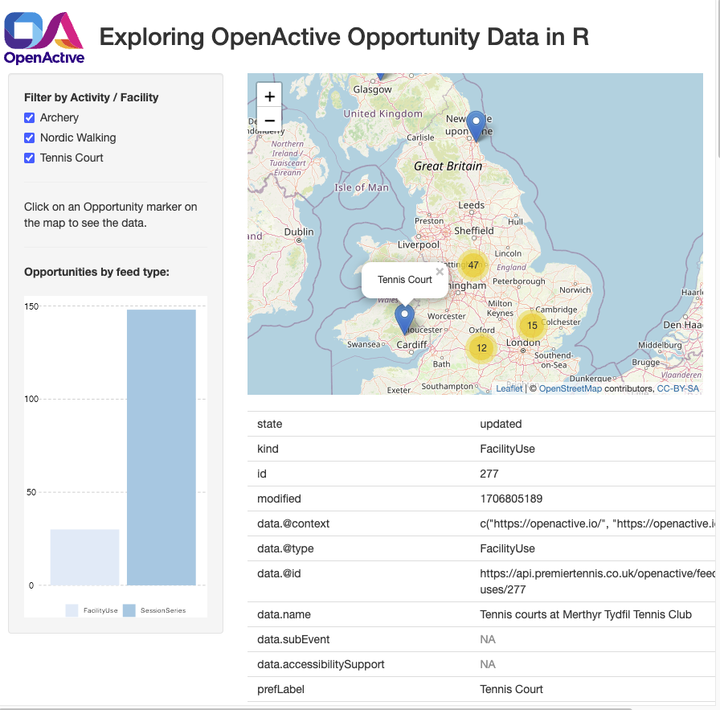

[](https://opensource.org/license/mit/)

# Explore OpenActive data with R code

Example R code to harvest and display open data about opportunities for sport and physical activity.

R is a free and open-source programming language and software environment specifically designed for statistical computing and graphics, popular with data scientists, statisticians, and researchers across various fields.

The code assumes users have a basic familiarity with R, but does not require knowledge of OpenActive data. It provides an introduction to some of the key concepts and data structures in OpenActive through simple examples.

The code below shows you:
- how to find all the OpenActive data feeds
- how to read a page from a feed to find basic details about opportunities for physical activity
- how to read and process a whole data feed
- how to create a simple app to display OpenActive data and filter results



## Setting up and listing OpenActive data feeds

This walkthrough assumes you're able to run R code. I recommend using recent versions of [RStudio](https://posit.co/downloads/) and [R](https://www.r-project.org/). I'm using RStudio 2023.09.1+494 "Desert Sunflower" Release for macOS, with R version 4.2.1 (2022-06-23) "Funny-Looking Kid"

OpenActive is a decentralised open data initiative - There is no single central database. Each publisher shares one or more data feeds. At time of writing, there are over 200 feeds. For convenience, the OpenActive team have created a very simple web application to gather all the feed URLs into one convenient list. Here, we can use that list as a start point.

The following code:
- creates a temporary folder to store the OpenActive data we will collect in this walkthrough
- loads some useful libraries for harvesting, manipulating and displaying the data
- reads the list of feeds, creates a data frame and displays the column names and some of the values

```
## Setting up

#Set a local folder for storing data between sessions
datastore = "OpenActive"

#Create the subfolder if it doesn't exist
if (!file.exists(datastore)) {
  print(paste("FOLDER DOES NOT EXIT SO CREATING:",datastore))
  dir.create(datastore)
} else {
  print(paste("FOLDER ALREADY EXISTS:",datastore))
}

setwd(datastore)

#Install libraries if needed with for example: install_packages("httr")

library(httr)  
library(jsonlite)  
library(dplyr)
library(tidyr)  
library(leaflet)  
library(shiny)
library(ggplot2)

## Listing data feeds
url_all_feeds = "http://dataset-directory.herokuapp.com/datasets"

res = try(GET(url_all_feeds), silent = T)
if (!inherits(res, "try-error")) {
  if (res$status_code >= 200 && res$status_code < 400) {
    data_feeds = NULL
    #If status ok, read content
    data_feeds=rawToChar(res$content)
    if (jsonlite::validate(data_feeds)==T) { 
      data_feeds=fromJSON(rawToChar(res$content))
      glimpse(data_feeds)
    } else {print("Unable to read data feeds JSON")}
  } else {print("Unable to read data feeds URL")}
  rm(res)
}
```

## Exploring a page from a data feed

The idea of OpenActive is to make it easier to discover what activities are available nearby. 
By sharing data about all the opportunities for physical exercise, people can design new apps and services to help people get active.

Let's start with just one of these data feeds.

Click this link to browse to the feed URL to see a page of live data in JSON format: <https://agb.sport80-clubs.com/openactive/session-series>

We'll create a simple function to call this feed URL, return the same live data and flatten it into a data frame. 

Note, although the JSON is flattened, there is still some nesting of data into data frames.

This is indicated where you see for example: ```[<data.frame[3 x 13]>]```

Details of the [full data model](https://openactive.io/modelling-opportunity-data/EditorsDraft/) can be found on the developer site but we can explore the basics here.

The information about individual opportunities for sport and physical activity is held in data$items.

We can use this information to answer "who, what, where and when" questions.

The following code:
- reads a page of OpenActive data and flattens it into a data frame
- filters out the first opportunity
- displays the who, what, where and when information
- displays some other useful information

```
# Call an API endpoint

callURL <- function(url) {
  res <- NULL
  #Check url
  res=GET(url)
  if (res$status_code >= 200 && res$status_code < 400) {
    res
  } else {
    print("Reading URL failed")
  }
}

d <- callURL("https://agb.sport80-clubs.com/openactive/session-series")

data = fromJSON(rawToChar(d$content),flatten = T)

rm(d)

names(data)

glimpse(data$items)
# Let's look at the first opportunity
opp = filter(data$items, state == "updated") %>% slice_head()
glimpse(opp)

#Thinking of the "who, what, where, when" questions:

#Who?
opp$data.organizer.name

#The "What" is usually contained in data.activity:
glimpse(opp$data.activity)

#This shows the relevant concepts chosen from a controlled vocabulary.
#What?
opp$data.activity[[1]]$prefLabel

#We can see "where" in the data.location fields:
glimpse(select(opp,contains("data.location")))

#With geospatial coordinates, we can plot the location on a map, using leaflet:

#Where?
leaflet() %>%
  addTiles() %>% 
  addMarkers(lng= opp$data.location.geo.longitude, 
             lat=opp$data.location.geo.latitude, 
             popup=opp$data.activity[[1]]$prefLabel)

#The "when" is not obvious at first glance - there is no date field.
#This is a feed of SessionSeries - it contains information that relates to a number of sessions.
#In this feed, the individual dated sessions are described in data.subEvent:

glimpse(opp$data.subEvent)

#This shows the number of individual sessions, the start and end dates and durations.

#When?
opp$data.subEvent[[1]]$startDate

#That covers the basics, but there is more information available.

#Running the following code should open up the webpage for the session series.
#You can see a range of other useful details, such as the cost and accessibility information.

browseURL(opp$data.url)

#The cost is shown in data.offers:

glimpse(opp$data.offers)

#There can be different costs for different groups e.g. members, public, adults, seniors, etc.

#Some information about accessibility and adaptations and support for disabled participants is shown here:

glimpse(opp$data.accessibilitySupport)

#Like the activity list, these terms are managed as concepts in a vocabulary.
```
Notes:

For the "what", we use a standardised list of activities, managed as concepts in a [controlled vocabulary](https://activity-list.openactive.io/en/hierarchical_concepts.html). 
This helps app designers to consistently present and group and filter activities in search interfaces.

The "when" may not be obvious at first glance - there is no date field. This is a feed of SessionSeries - it contains information that relates to a number of sessions. 
The date and time information that relates to an individual scheduled session is handled separately. 
In some cases, SessionSeries are linked to a separate ScheduledSession feed by an id variable. 
However, in this feed, the individual dated sessions are described in data.subEvent.

Ideally, the URL provided for an individual session takes a user directly to the booking page for that session. 
This simplifies the user journey of discovering and booking, reducing barriers and helping people get active.

OpenActive also has a draft [controlled vocabulary for accessibility support](https://openactive.io/accessibility-support/), but not all providers use this.

## Reading all the pages in a data feed

Remember the goal is to simplify the user journey from discovering an activity to booking it. It would be frustrating to discover an activity in a search but then to find it is fully booked. To avoid this, we have to find a way to keep availability up to date, potentially for millions of activities, in near real time, without creating too much demand on data publishers systems.

The solution OpenActive have developed is called the [Realtime Paged Data Exchange](https://developer.openactive.io/publishing-data/data-feeds/how-a-data-feed-works), or RPDE.

You can check out the link above for full details. For now, the key points are:
1. data is served in pages
2. each page includes a link to the next page
3. you keep a copy of the data, so you only need to pick up the new pages
4. an opportunity can appear more than once, on more than one page
5. the latest version of each opportunity has the most up to date information
6. opportunities have a state of either "updated" or "deleted"

Looking again at the feed we returned earlier, there is a field called "next" that lists the URL of the next page in the feed.
This is a URL with same base or stem but with added parameters: afterTimestamp and afterId.
This tells a data consumer where to pickup reading the feed.
If the next page is empty, then we have no new items to consider - we are at the end of the feed.
But if new items are found, we need a way to store them alongside the original data.
This allows us to minimise the burden on publishers systems and to do the processing required for RPDE points 4, 5 and 6 above.

Here's one approach:
- Create a folder to store the data from pages you've read already
- Create a "control table" or similar to track what page you are on
- Start reading a feed, appending new data to any existing data and storing after each page
- Update the control table

This means you can pick up reading a feed without starting all over again, minimising the burden on publishers and making it easier to resume after any error.

The following code:
- looks at the data collected earlier to identify the next page in the feed
- checks if there is new data to process or if we've reached the end of the feed
- creates a function to read, process and store whole data feeds, as per the process above.


```
#Looking again at the feed we returned earlier
names(data)
#There is an field called "next" that lists the url of the next page in the feed:
data["next"]
#This is the same base or stem in the url with added parameters: afterTimestamp and afterId.
#This tells a data consumer where to pickup reading the feed.

#Using the earlier function, we can call this new url:

d <- callURL(as.character(data["next"]))
next_page = fromJSON(rawToChar(d$content),flatten = T)
rm(d)
glimpse(next_page)

#Look at the items in this new page.
#If it is empty or null (an empty list in this case) then we have no new items to consider - we are at the end of the feed.
#But if new items are found, we need a way to store them alongside the original data. 

#The following code does just that:

#Check you're in the local folder for storing data between sessions
getwd()

#Create a control table
control <- data.frame(feed_no=1:3,stem=c("https://agb.sport80-clubs.com/openactive/session-series",
                                         "https://opendata.exercise-anywhere.com/api/rpde/session-series",
                                         "https://api.premiertennis.co.uk/openactive/feed/facility-uses"),NEXT="")
control$NEXT <- ifelse(control$NEXT=="",control$stem,control$NEXT)
#Save to file in the folder
saveRDS(control, file="control.rds")

#Steps to harvest data from a list of feeds in a control table
#1) Get stems from control table
#2) Check control table to see which page to read
#3) Read a page 
#4) Check if the page has new data
#5) Read in any existing data
#6) Append rows
#7) Sort by id and modified and keep last modified
#8) Store the updated data
#9) Update the control table.
#10) If end of feed: go on to next feed
#11) If not: Go back to start

#First, here's a slightly more robust version of the earlier callURL function
#It also includes a check to see if 5 seconds has passed since last call, to reduce burden on data providers
callURL <- function(url,lastStartTime) {
  # Check if at least 5 seconds have passed before calling URL
  elapsedTime <- difftime(Sys.time(), lastStartTime, units = "secs")
  if (elapsedTime < 5) {
    Sys.sleep(5 - as.numeric(elapsedTime))
  }
  res <- NULL
  res = try(GET(url), silent = T)
  if (!inherits(res, "try-error")) {
    if (res$status_code >= 200 && res$status_code < 400) {
    } else {
      print("Reading URL status error")
    }
  } else {
    print("Reading URL failed")
  }
  res
}

#A quick function to tidy up after reading each page
cleanUp <- function() {
  objects <- c("control","d","data","dataToStore","endOfFeed","files","nextUrl","previous")
  for (object in objects)
    if (exists(object)) {rm(object)}
}

#A function to harvest OA data 
updateFeeds <- function() {
  #1) Get no of feeds from control table
  control <- readRDS(file="control.rds")
  n_stems <- nrow(control)
  rm(control)
  #For each stem
  feed <- 1
  page <- 1
  startTime <- Sys.time()-5
  while (feed <= n_stems) {
    #2) Identify next page for the feed
    control <- readRDS(file="control.rds")
    nextUrl = filter(control, feed_no==feed)$NEXT
    print(paste("Reading feed:", feed, " page:",page,"-",nextUrl))
    #3) Read next page
    lastStartTime <- startTime
    startTime <- Sys.time()
    d <- callURL(nextUrl,lastStartTime)
    #If read page ok, read content
    if (!is.null(d)) {
      data=rawToChar(d$content)
      if (jsonlite::validate(data)==T) {
        #If JSON is valid, unpack it
        data = fromJSON(rawToChar(d$content),flatten = T)
        #4) Check if the new page has items
        if (is.data.frame(data$items)) {
          if (is.data.frame(data$items) & nrow(data$items)>0) {
            #5) Appending new data to any existing data
            files = list.files()
            previous = paste0("feed_no_",feed,".rds")
            if (previous %in% files) {
              print(paste("READING PREVIOUS DATA AND ADDING",nrow(data$items),"ITEMS"))
              dataToStore <- readRDS(previous)
              #6) Append the new rows
              dataToStore <- bind_rows(dataToStore,data$items)
              #7) Sort by id and modified and keep last modified
              dataToStore <- arrange(dataToStore,id,modified) %>% group_by(id) %>% slice_tail()
            } else {
              print(paste("NO PREVIOUS DATA - CREATING FILE AND ADDING",nrow(data$items),"ITEMS"))
              dataToStore = data$items
            } 
            #8) Store the updated data
            #For displaying live opportunities, remove any "deleted" items
            dataToStore <- filter(dataToStore,state=="updated")
            saveRDS(dataToStore, file=paste0("feed_no_",feed,".rds"))
          } else {
            print("NO NEW ITEMS")
          }
        } else {
          print("NO NEW ITEMS")
        }
        #9) Update the control table:
        control$NEXT[control$feed_no == feed] <- data$`next` 
        saveRDS(control, file="control.rds")
        
        #10) If end of feed: stop
        #Simple check for end of feed - next URL is same as the URL you just called
        endOfFeed = ifelse(nextUrl==data$`next`,TRUE,FALSE)
        if (endOfFeed) {
          print("END OF FEED")
          #clean up
          cleanUp()
          #Go to next line in control table
          feed=feed+1
          page = 1
        } else {
          #11) If not: Go back to start 
          print("CHECK NEXT PAGE")
          page=page+1
        }
      } else {print("Invalid JSON")}
    } else {print("Unable to read next page")}
  }
}

#Execute this function
updateFeeds()

#Quick test of collected data

opp <- readRDS("feed_no_1.rds")

leaflet() %>%
  addTiles() %>% 
  addMarkers(lng= opp$data.location.geo.longitude, 
             lat=opp$data.location.geo.latitude, 
             popup=opp$data.activity[[1]]$prefLabel)


```

## Creating a simple shiny app to display and filter OpenActive data

Now we have a store of OpenActive opportunity data, we can explore what activities are available.

The following code:
- displays the opportunity data from the feeds collected earlier
- allows you to filter by activity or facility type
- displays the raw data for each opportunity

Notes:

Only records with latitude and longitude are shown.

There is some processing to unpack the activity and facility type labels into a consistent form.

The "raw" data for an opportunity is not the original JSON, but the R data frame version where nested JSON is converted to lists.

```

#Combine the OA data from the collected feeds
control <- readRDS(file="control.rds")
feeds <- unique(control$feed_no)
OAData <- data.frame()
for (feed in feeds) {
  print(feed)
  previous = paste0("feed_no_",feed,".rds")
  dataToAdd <- readRDS(previous)
  #Pull out activity if available
  if ("data.facilityType" %in% names(dataToAdd)) {
    dataToAdd <- hoist(dataToAdd, data.facilityType, "prefLabel")
  }
  if ("data.activity" %in% names(dataToAdd)) {
    dataToAdd <- hoist(dataToAdd, data.activity, "prefLabel")
  }
  
  #Handle variable format issues
  dataToAdd <- bind_rows(OAData, dataToAdd %>% mutate_all(as.character))
  print(paste("ADDING",nrow(dataToAdd),"ITEMS"))
  OAData <- bind_rows(OAData,dataToAdd)
}

OAData <- OAData %>% type.convert() %>% filter(!is.na(data.location.geo.latitude))


#Define UI for a simple application
ui <- fluidPage(
  #css for visual styling
  tags$style("#logo {margin: 0px 10px}"),
  #header row
  titlePanel(fluidRow(
    tags$img(src = "https://www.openactive.io/wp-content/themes/open-active-1_4/images/open-active-logo.svg", 
             width = "100px", id = "logo"), "Exploring OpenActive Opportunity Data in R")),
  
  #Sidebar with filters
  sidebarLayout(
    sidebarPanel(
      checkboxGroupInput(
        "activity", "Filter by Activity / Facility",
        choices = unique(OAData$prefLabel), 
        selected = unique(OAData$prefLabel)
      ),
      hr(), #Add a horizontal divider
      p("Click on an Opportunity marker on the map to see the data."),
      hr(), 
      strong("Opportunities by feed type:"),
      br(),br(),
      plotOutput("myplot", width="100%")
    ),
  #Main panel
  mainPanel(
      leafletOutput("mymap"),
      br(), 
      tableOutput("record")
    )
  )
)

#Define server logic to run the app
server <- function(input, output) {
  
  #Apply filters
  subsetted <- reactive({
    req(input$activity)
    OAData |> filter(prefLabel %in% input$activity)
  })
  
  #Display map
  output$mymap <- renderLeaflet({
    leaflet() %>%
      addTiles() %>%
      addMarkers(lng=subsetted()$data.location.geo.longitude, 
                 lat=subsetted()$data.location.geo.latitude, 
                 popup=subsetted()$prefLabel, layerId = subsetted()$id,
                 clusterOptions = markerClusterOptions())
    
  })
  
  #Display chart
  output$myplot <- renderPlot({
    ggplot(OAData, aes(x=kind, fill=kind)) + 
      geom_bar( ) + scale_fill_brewer() + theme_void() + 
      theme(legend.position="bottom", legend.title = element_blank(),
            axis.text.y = element_text(), 
            panel.grid.major.y = element_line(color = "gray", linetype = "dashed")
      )
  })
  
  #When map marker clicked, show raw data
  observeEvent(input$mymap_marker_click, {
    record <- t(filter(subsetted(), id == input$mymap_marker_click$id))
    output$record <- renderTable(record, colnames = F, rownames = T)
  })
}

#Run the application 
shinyApp(ui = ui, server = server)

  
```

There you have it - an intro to exploring OpenActive opportunity data in R.

That covers the basics. Areas for further exploration:
- combining linked data feeds:
    - SessionSeries (e.g. Yoga Class) and ScheduledSessions (Thursday at 8pm)
    - FacilityUse (e.g. Squash Court) and Slots (Thursday 6pm to 6:30pm)
    
    For more details, see [Types of RPDE feed](https://developer.openactive.io/publishing-data/data-feeds/types-of-feed)
- handling inconsistencies between feeds, for example:
    - the formatting of "NEXT" URLs: a few providers only provide the parameters, not the whole URL
